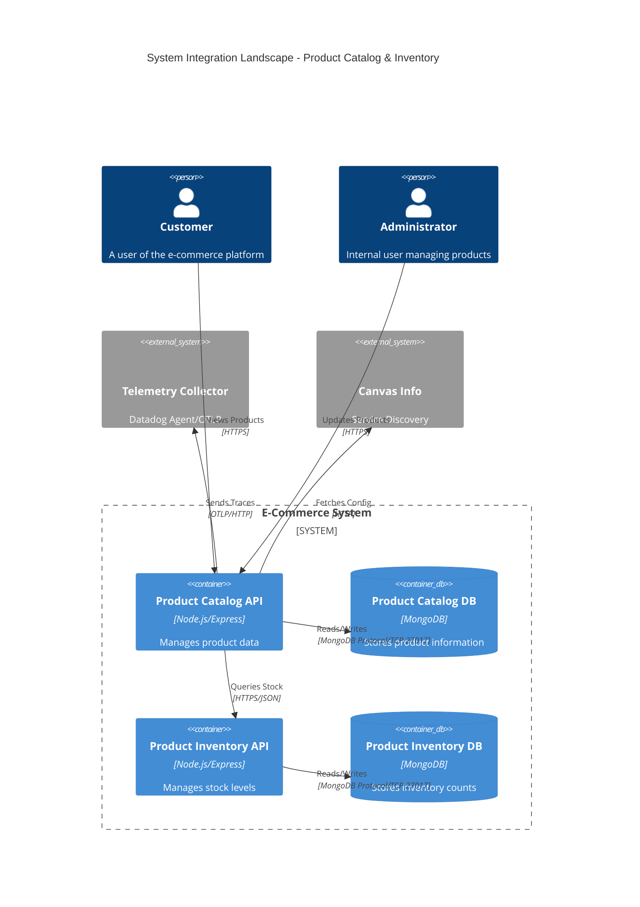
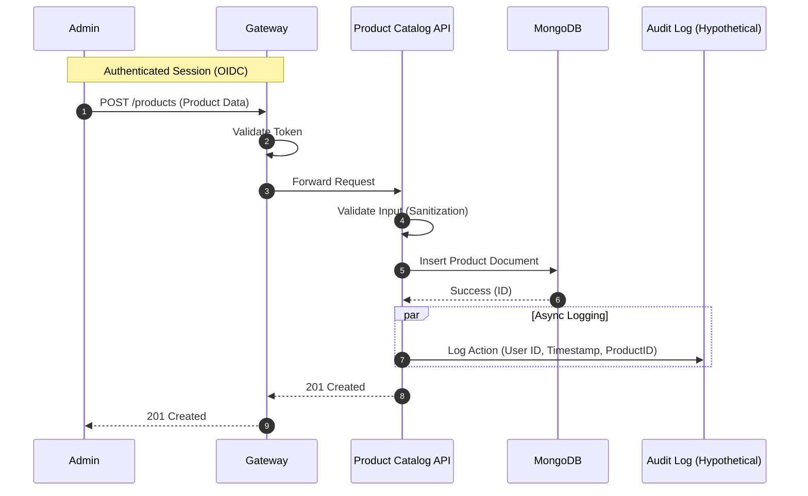

# Integration Landscape & Data Flow Documentation

This document provides a visual and tabular representation of the system's integration landscape, focusing on data flows, data sensitivity (PII), and security controls.

## Recommended Tools & Notation

*   **Notation**: [C4 Model](https://c4model.com/) (Context, Container, Component, Code) for architectural diagrams.
*   **Tools**: [Mermaid.js](https://mermaid.js.org/) for defining diagrams as code within Markdown. This allows for version control and easy rendering in GitHub/GitLab/IDEs.
*   **Format**: Markdown tables for the detailed integration catalog.

## 1. Visual Landscape (C4 Container Diagram)

The following diagram illustrates the high-level containers and their interactions.

## 2. Integration & Data Flow Catalog

This table details the specific data flows, highlighting security and compliance aspects.

| ID | Source Component | Target Component | Protocol / Interface | Data Description | Data Classification / PII | Security Controls & Concerns |
| :--- | :--- | :--- | :--- | :--- | :--- | :--- |
| **INT-001** | `ProductCatalogAPI` | `MongoDB` | TCP / 27017 (Mongo Wire) | Product details, descriptions, prices. | **Internal**. No PII in catalog data usually. | **Concern**: Unencrypted storage?   **Control**: TLS enabled, Auth enabled. |
| **INT-002** | `ProductCatalogAPI` | `OTLP Collector` | HTTP / 4318 | Application traces, performance metrics. | **Internal**. Potential incidental PII in logs? | **Concern**: Data leakage in logs.   **Control**: Log sanitization filters. |
| **INT-003** | `Customer` | `ProductCatalogAPI` | HTTPS / 443 | GET requests for product lists. | **Public**. | **Concern**: DDoS, Scraping.   **Control**: Rate limiting, WAF. |
| **INT-004** | `Admin` | `ProductCatalogAPI` | HTTPS / 443 | POST/PUT product updates. | **Confidential**. | **Concern**: Unauthorized changes.   **Control**: OAuth2/OIDC, RBAC (Role: Admin). |
| **INT-005** | `ProductCatalogAPI` | `CanvasInfo` | HTTP | Service discovery/config data. | **Internal**. | **Concern**: Internal network trust. |

## 3. Detailed Data Flow (Sequence Diagram)

For critical flows (e.g., involving PII or financial data), use a sequence diagram.

### Scenario: Product Update by Admin

## How to use this template

1.  **Map your components**: Update the Mermaid C4 diagram with your actual microservices from `charts/` (e.g., `partyroleapi`, `promotionmanagementapi`).
2.  **Audit Data Types**: Fill the "Data Classification" column in the table. Tag fields as `PII`, `PCI`, `Public`, `Internal`, or `Confidential`.
3.  **Identify Risks**: Consult with InfoSec to fill the "Security Controls & Concerns" column.
